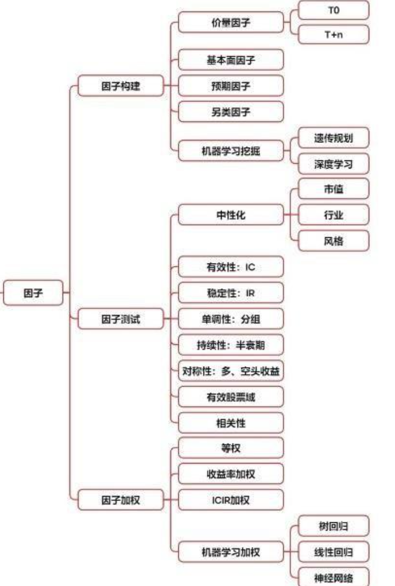
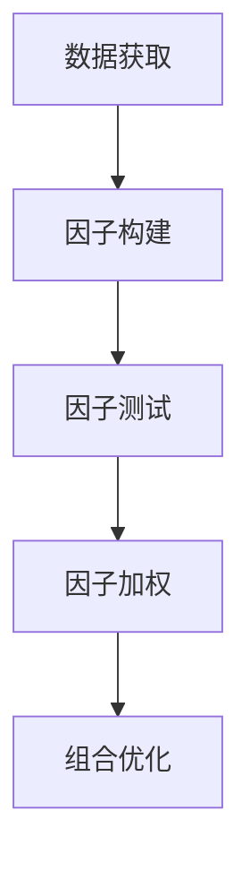

以下是基于项目文件整理的标准化`PRD.md`技术文档，采用模块化结构呈现量化因子分析项目的完整技术框架：

流程参考：https://zhuanlan.zhihu.com/p/684300637

```markdown
# 量化多因子模型技术文档


## 一、项目架构


## 二、核心模块说明

### 1. 数据获取模块 (`data_fetch.ipynb`)
- **数据源**：Tushare Pro API
- **覆盖范围**：电气设备行业（申万二级分类）
- **数据字段**：
  ```python
  # 日线行情
  ['ts_code', 'trade_date', 'open', 'high', 'low', 'close', 'vol']
  
  # 基本面数据
  ['pe_ttm', 'pb', 'total_mv', 'turnover_rate']
  ```
- **注意**：
  - 分页批量获取（可能会有最多获取一月情况，可按月获取后合并）

### 2. 因子构建模块 (`data_construct.ipynb`)
#### 关键处理流程
```python
# 典型因子计算示例
df['MA20_deviation'] = (df['close'] - df['close'].rolling(20).mean()) / df['close'].rolling(20).std()
df['ATR_ratio'] = talib.ATR(df['high'], df['low'], df['close'], 20) / df['close']
```

### 3. 因子测试模块 (`factor_test.ipynb`)
#### 分析工具链
graph LR
    A[Alphalens] --> B[分组收益分析]
    C[Scipy] --> D[icir检验]
    E[Sklearn] --> F[互信息计算]

### 4. 因子加权模块
#### 机器学习加权
```python
# XGBoost特征重要性提取
xgb = XGBRegressor(objective='reg:squarederror')
xgb.fit(X_train, y_train)
```


**参考资料**

>【1】https://zhuanlan.zhihu.com/p/435430759
>
>【2】https://www.zhihu.com/question/51965191
>
>【3】https://www.wolai.com/stupidccl/i5c453vBLh4Q9ADQmwM8Xg

---
> 文档版本：v1.1 
> 最后更新：2025-4-22  
> 3261429254@qq.com
```


建议配合项目中的Jupyter Notebook文件交叉阅读，所有代码块均可直接在对应notebook中找到完整实现。> E[组合优化]